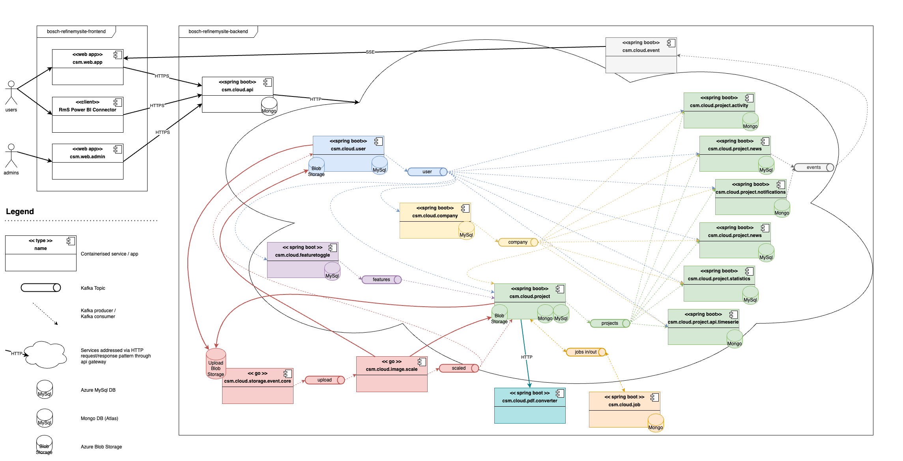

# Bosch RefinemySite (Backend)

Bosch RefinemySite is a cloud-based collaboration platform for the construction industry. 

It involves all trades of a construction project at an early stage of the overall schedule and thereby includes all 
particular knowledge of all participants in an aligned schedule.

This method increases the stability of processes during execution, fostering a common understanding of all trades. 
The assigned work can be tracked within a continuous improvement workflow and all task can be documented.

# _!!! Sunset Notice !!!_

> _All sources contained in this repository have been developed as part of Bosch RefinemySite project at Robert Bosch Power Tools GmbH._
>
> _RefinemySite is not being developed by Robert Bosch Power Tools GmbH any further._
>
> :warning: ___The sources are provided as is and are not actively maintained or supported in any way__._ :warning: 

# Prerequisites

For building and deploying the sources provided here, a few (major) preparatory adjustments are necessary:
- Adjust repository references in _build.gradle_ and _settings.gradle_ files of all libraries and services to reflect your own packaging/artifacts solution like Azure Artifacts.
- Build and publish the backend libraries to your own packaging/artifacts solution.
- Adjust the dependency references for the libraries (name and version) as needed.
- Set up your own Identity Provider (IdP) and configure OAuth settings: 
  - in particular in csm.cloud.api configuration.
  - in _csm.cloud.common.core/src/main/resources/application-idp-bosch-dev.yml_ and _csm.cloud.common.core/src/main/resources/application-idp-bosch-prod.yml_.
- Implement your own notification endpoint integration (i.e. a web hook) in _csm.cloud.project.notifications/src/main/kotlin/com/bosch/pt/csm/cloud/projectmanagement/user/facade/listener/UserEventListenerImpl.kt_ 
- In _csm.cloud.project.project_ and _csm.cloud.user.user_ services, supply test image sources as needed or adjust the tests implementations instead.
- Adjust all _Dockerfile_ files to use your own container image library or a public one instead.
- Adjust or replace all _azure-pipeline.yml_ to suit your own build and deployment needs.
- In _csm.web.app_ supply your own icons as SVGs in _/src/assets/icons_ 
- Set up a suitable infrastructure (with an AKS or other Kubernetes runtime and MySql and MongoDB databases as well as Azure Storage Accounts). The local deployment scripts in _utilities/csm.cloud.dev/docker_ will give you a deeper understanding of the runtime environment needed.

# Project Structure

The system is composed of the following parts:
- [Frontends](https://github.com/boschglobal/bosch-pt-refinemysite-frontend) published under MIT license.
- [Backend services and libraries](https://github.com/boschglobal/bosch-pt-refinemysite-backend) published under Apache 2.0 license.

The architecture of the configured and deployed solution could look like this:

The diagram above depicts the coarse decomposition of the system with its backend services and most Kafka-based communication flows. 
All components are described below in more detail.

## Clients / Frontends

There are two web-based frontends. Both are built with Angular and deployable in an nginx-based container.

### RefinemySite Web Application
The Primary UI to RefinemySite for end-users. Offers all features and functionalities described above.
- [csm.web.app](https://github.com/boschglobal/bosch-pt-refinemysite-frontend/tree/main/csm.web.app)

### RefinemySite Web Admin Application
Administrative application to be used by support personnel to assign users as employees to companies with specific RefinemySite roles. 
Allows to administer users, employees and companies from vendor/support side.
- [csm.web.admin](https://github.com/boschglobal/bosch-pt-refinemysite-frontend/tree/main/csm.web.admin)

## BACKEND: Cloud backend contexts and services

The cloud backend is organized in bounded contexts inspired by DDD methodology. 
Each bounded context is made up of one or more backend services.

### User Management Context

The User Management context deals with the registration of users on RefinemySite. 
It contains the sign-up process as well as processes around the maintenance of a user account (i.e. user profile picture) and makes sure all information about a user are in place before a user can be used in RefinemySite.

#### User Service

The user service deals with the registration and profile management of users and therewith implements the main functionality of the user management context.

- [csm.cloud.user.user](https://github.com/boschglobal/bosch-pt-refinemysite-backend/tree/main/services/csm.cloud.user.user)
- [csm.cloud.user.avro](https://github.com/boschglobal/bosch-pt-refinemysite-backend/tree/main/libraries/csm.cloud.user.avro)

### Company Management Context

The Company Management context deals with the registration of companies, the maintenance of their organisational structure (like users being employees in a company) and so on. 
This information can be used to derive authorisation information from it (i.e. to decide in the project context, which users are allowed to create projects etc.).

#### Company Service

The company service implements all functionality that is covered by the company management context.

- [csm.cloud.company.company](https://github.com/boschglobal/bosch-pt-refinemysite-backend/tree/main/services/csm.cloud.company.company)
- [csm.cloud.company.avro](https://github.com/boschglobal/bosch-pt-refinemysite-backend/tree/main/libraries/csm.cloud.company.avro)

### Project Management Context

The Project Management context is the main context of the capability "Construction Site Management (CSM)". 
It contains all processes around project and task management, lean construction management etc.).

The functionality inside this context is split to the following components (each being a separate Sprint Boot backend service):

#### Project Service

The project service contains the main processes related to project and task management and lean construction management. 
Since it is a "source" service, it is responsible for providing all data in the form of events (according to our event log pattern) so that downstream services can make use of them.

- [csm.cloud.project.project](https://github.com/boschglobal/bosch-pt-refinemysite-backend/tree/main/services/csm.cloud.project.project)
- [csm.cloud.project.avro](https://github.com/boschglobal/bosch-pt-refinemysite-backend/tree/main/libraries/csm.cloud.project.avro)

#### Project Activities Service

The project activities service transforms the stream of project events into an "activity stream". 
An activity is a representation of an event in a user-friendly way and provides information about a change that happened on an aggregate of the project context. 
Currently, only events for tasks and "sub-aggregates" of a task are recorded and provided as an activity stream for a selected task. 
Since events always come with a full snapshot of the corresponding aggregate, the activity service provides functionality to calculate the difference between two consecutive aggregate versions (coming with two consecutive events). Since this information is derived from the stream of events, the activities are eventual consistent.

- [csm.cloud.project.activity](https://github.com/boschglobal/bosch-pt-refinemysite-backend/tree/main/services/csm.cloud.project.activity)

#### Project News Service

The project news service transforms the stream of project events into news marker for each user. 
It knows which event is relevant for which user and marks (currently only) tasks with a user-specific _news flag_ in case something relevant on a task happened since the user last visited the task. 
Since this information is derived from the stream of events, the news markers are eventually consistent.

Furthermore, the news service sends Live Update Events as messages to the Event Service in order to distribute them to currently connected users.

- [csm.cloud.project.news](https://github.com/boschglobal/bosch-pt-refinemysite-backend/tree/main/services/csm.cloud.project.news)

#### Project Notification Service

The project notification service transforms the stream of project events in notifications for each relevant user. 
It knows which event leads to which notification and determines the list of recipients. 
Furthermore, it persists notifications per user as a kind of inbox and keeps track of the "seen" state of a users notification list as a whole as well as of each single notification. 
It also sends messages to the Event Service to actively inform users about new notifications being available.

- [csm.cloud.project.notifications](https://github.com/boschglobal/bosch-pt-refinemysite-backend/tree/main/services/csm.cloud.project.notifications) 

#### Project Statistics Service

The project statistics service calculates key performance indicators according to the lean construction principles. 
The figures provide insights into amount of daycards completed in time etc. 
It uses the kafka event stream to derive statistics from events.

- [csm.cloud.project.statistics](https://github.com/boschglobal/bosch-pt-refinemysite-backend/tree/main/services/csm.cloud.project.statistics)

#### Project API Timeseries Service

The project timeseries service represents the backbone of the public API of RefinemySite. 
It consumes all project data from Kafka topics and materializes that data in an easily accessible data structure providing bulk project information as well as timeline-based project information (based on Kafka event records the project is made up of).

- [csm.cloud.project.api.timeseries](https://github.com/boschglobal/bosch-pt-refinemysite-backend/tree/main/services/csm.cloud.project.api.timeseries)

### Job Context

The Job Context covers support for (long-running) jobs.

#### Job Service

The job service handles (possibly) long-running asynchronous jobs.

- [csm.cloud.job.job](https://github.com/boschglobal/bosch-pt-refinemysite-backend/tree/main/services/csm.cloud.job.job)

### Storage Context

The Storage Context covers generic interaction with file storage.

#### Storage Event Service

The storage event service listens to Azure Storage Queue of Azure Storage Account Container. 
Whenever a file is uploaded to the container an event is emitted to a Kafka topic allowing for further processing.

-  [csm.cloud.storage.event.core](https://github.com/boschglobal/bosch-pt-refinemysite-backend/tree/main/services/csm.cloud.storage.event.core)

### Image Context

The Image Context covers image-specific workloads.

#### Image Scale Service

The image scale service listens to Kafka events provided by storage event service and scales images in specifically configured target sizes. 
The results (originals and scaled images) are uploaded into project and user storage accounts. 
The user and project services are informed via Kafka events about image scaling results.

-  [csm.cloud.image.scale](https://github.com/boschglobal/bosch-pt-refinemysite-backend/tree/main/services/csm.cloud.image.scale) 

### Feature Toggle Context

The Feature Toggle Context provides feature toggles.

### Feature Toggle Service

The service allows to easily create feature toggles. 
A feature can be enabled, disabled or enabled for whitelisted subjects with subjects being specific companies or projects. 
Downstream services required to implement the toggles are informed via Kafka topic on toggle states.

- [csm.cloud.featuretoggle.core](https://github.com/boschglobal/bosch-pt-refinemysite-backend/tree/main/services/csm.cloud.featuretoggle.core) 
- [csm.cloud.featuretoggle.avro](https://github.com/boschglobal/bosch-pt-refinemysite-backend/tree/main/libraries/csm.cloud.featuretoggle.avro)
- [csm.cloud.featuretoggle.lib](https://github.com/boschglobal/bosch-pt-refinemysite-backend/tree/main/libraries/csm.cloud.featuretoggle.lib)

### Without specific context

There are a number of services and libraries that cannot be attributed to any or just one bounded context.
These are listed below.

### Common repositories

(used in multiple services across bounded contexts):

- [csm.cloud.common.avro](https://github.com/boschglobal/bosch-pt-refinemysite-backend/tree/main/libraries/csm.cloud.common.avro) 
- [csm.cloud.common.blob](https://github.com/boschglobal/bosch-pt-refinemysite-backend/tree/main/libraries/csm.cloud.common.blob)
- [csm.cloud.common.core](https://github.com/boschglobal/bosch-pt-refinemysite-backend/tree/main/libraries/csm.cloud.common.core)
- [csm.cloud.common.event-consumer](https://github.com/boschglobal/bosch-pt-refinemysite-backend/tree/main/libraries/csm.cloud.common.event-consumer)
- [csm.cloud.common.go-app](https://github.com/boschglobal/bosch-pt-refinemysite-backend/tree/main/libraries/csm.cloud.common.go-app)
- [csm.cloud.common.kafka](https://github.com/boschglobal/bosch-pt-refinemysite-backend/tree/main/libraries/csm.cloud.common.kafka)
- [csm.cloud.common.mongodb](https://github.com/boschglobal/bosch-pt-refinemysite-backend/tree/main/libraries/csm.cloud.common.mongodb)
- [csm.cloud.common.mysql](https://github.com/boschglobal/bosch-pt-refinemysite-backend/tree/main/libraries/csm.cloud.common.mysql)
- [csm.cloud.common.streamable](https://github.com/boschglobal/bosch-pt-refinemysite-backend/tree/main/libraries/csm.cloud.common.streamable)
- [csm.cloud.common.web](https://github.com/boschglobal/bosch-pt-refinemysite-backend/tree/main/libraries/csm.cloud.common.web)
- [csm.cloud.dependency-management](https://github.com/boschglobal/bosch-pt-refinemysite-backend/tree/main/libraries/csm.cloud.dependency-management)
- [csm.cloud.i18n-plugin](https://github.com/boschglobal/bosch-pt-refinemysite-backend/tree/main/libraries/csm.cloud.i18n-plugin)
- [csm.cloud.i18n-plugin](https://github.com/boschglobal/bosch-pt-refinemysite-backend/tree/main/libraries/csm.cloud.i18n-plugin)

#### API Service

The API Service serves as entry point for all requests and forwards all requests to the appropriate backend service. 
It acts as an __Application Gateway__.

- [csm.cloud.api](https://github.com/boschglobal/bosch-pt-refinemysite-backend/tree/main/services/csm.cloud.api) 

#### Event Service

The event service is a technical component providing a Server Sent Event (SSE) endpoint to receive an event stream containing various events. 
Clients can establish a connection to this endpoint to receive events sent from the server to the clients. The first use case for this are so called "Live Update Events" that notify a client about a resource that was somehow changed.

- [csm.cloud.event](https://github.com/boschglobal/bosch-pt-refinemysite-backend/tree/main/services/csm.cloud.event)

#### PDF Converter

The PDF converter service generates PDFs for schedules and such.

- [csm.cloud.pdf.converter](https://github.com/boschglobal/bosch-pt-refinemysite-backend/tree/main/services/csm.cloud.pdf.converter)

#### Kafka Connector

The Kafka connector is actually not a service bound to any context. 
It is a technical component that transfers events written to a database table inside a service (that owns data) to a Kafka topic in a reliable way (at-least-once semantics). 
We use this in order to solve the __dual-write problem__ when updating a local data store and writing events in parallel (based on a transactional outbox-pattern within the service).

Since we need a deployment of this service for each primary service, we have multiple helm charts, one for each primary service.

- [csm.cloud.kafka.connector](https://github.com/boschglobal/bosch-pt-refinemysite-backend/tree/main/services/csm.cloud.kafka.connector)

#### Operations Utilities

Contains a number of scripts that help to operate the application with technologies like Kubernetes and Kafka.

- [csm.dev.tools](https://github.com/boschglobal/bosch-pt-refinemysite-backend/tree/main/utilities/csm.dev.tools)
- [csm.cloud.dev](https://github.com/boschglobal/bosch-pt-refinemysite-backend/tree/main/utilities/csm.cloud.dev)
- [csm.cloud.reset](https://github.com/boschglobal/bosch-pt-refinemysite-backend/tree/main/services/csm.cloud.reset)

# 3rd Party Software Used

This project contains third-party software components listed under [Third-Party Software](3rd-party.md).
These components are Open Source Software licensed under a license approved by the Open Source Initiative 
(www.opensource.org).

# License 

The sources in this repository are Open Source released under [Apache 2.0](LICENSE) license.

# Authors & Contributors

- Axel Gauweiler
- [Axel Schüssler](https://github.com/bitterblue)
- Benjamin Höhensteiger
- [Christian Schaible](https://github.com/cschaible)
- Corvin Schapöhler
- Katharina Kleiner
- [Lars Dülfer](https://github.com/larsduelfer)
- Mareike Lowinski
- Mert Yücel
- Nicolas Steimmig
- Peter Kleimann
- Rafael Franca
- Renato Cruz
- Sebastian Maximilian Jackisch
- [Simon Hartmann](https://github.com/simsibimsiwimsi)

_Missing yourself on this list?_ If you are a former contributor or code author of RefinemySite project you may reach out to the current maintenance team or simply create a pull request adding yourself to the list. As code-author you are entitled to be named as author of the software or to remain anonymous. If you add your name as an author of the given software, you agree that your name will be published with said software. You are fully aware that after a contribution your name cannot be removed from copies of the software in the OSS community.
