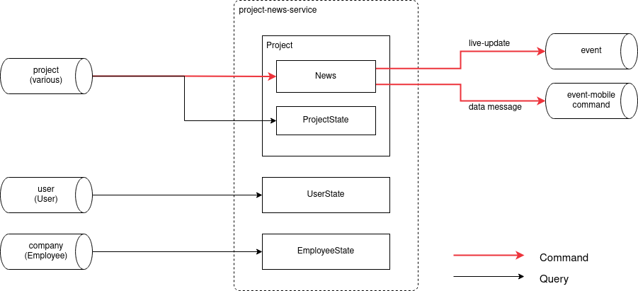

# RefinemySite Project News Service

## Purpose

This service provides information about what changed in the Project domain
since a User last accessed it (News).  It also notifies web and mobile clients
about changes so that they can keep their local state in sync and display
changes to the User as they happen.

Note: The information provided by this service is used to sync clients and
highlight changes to the user in the UI.  This is not the service providing
Notifications (about events that are highly relevant to a limited set of
Project Participants, and shown behind the bell icon in the apps).  This is
also not the service providing information about Activities (things that Users
did to a Task and that are shown in aggregate in the Task's activity stream).

## Context and Subdomain

The News service is part of the Project domain.  It consumes events from the
three major upstream domains: User, Company, and Project.  The service depends
on the Event service for live updates to the web app.

The News service keeps state about User-Company and User-Project relations to
determine recipients of News items.  News is created for all active
Participants of a Project.  It also stores News items for later retrieval via
REST by applications that were offline at the time of the event.

## Solution Building Blocks

### Business Transactions

The News service processes [Business
Transactions](https://bosch-pt.atlassian.net/wiki/spaces/SMAR/pages/11478631031/Business+Transactions)
on the Project event stream to ensure that News items are not generated when
a Project is copied or imported.

### Event Service

To notify web app instances that News are available for the logged-in User, the
News service makes use of the [Event
service](https://bosch-pt.atlassian.net/wiki/spaces/SMAR/pages/7802200362/Pushing+Events+to+Frontend+Clients).
The sent events prompt web apps to synchronize state with the backend.

