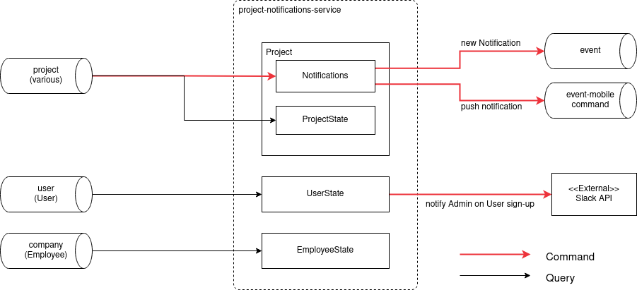

# RefinemySite Project Notification Service

## Purpose

This service creates Notifications about events that took place in the Project
domain and are highly relevant to a limited number of Participants (usually the
CSMs, the FM assigned to a Task, and their CR).  Notifications are displayed at
the bell icon in the frontend applications.

Note: This service is used to notify users about events that are relevant to
their work.  This is not the service that provides general information about
changes in the Project domain to all Participants (see News service), nor is
this the service that generates the aggregated stream of Activities performed
by Users on a Task (see Activity service).

## Context and Subdomain

The Notification service is part of the Project domain.  It consumes events
from all of the three major upstream domains: User, Company, and Project.  The
service depends on the Event service to notify web client instances about new
Notifications.

The service keeps detailed state information to determine recipients and type
of Notifications and provide user-readable information (e.g. a users display
name or a task title) to fill into translated notification templates.  It also
stores the generated Notifications and provides them to frontends via REST.

In addition to Notifications within the Project domain, the service also
informs RmS admins via Slack about new user sign-ups.  Sign-up messages via
Slack are directed at either US or general admins, depending on the country of
the new User.

## Solution Building Blocks

### Business Transactions

The Notification service processes [Business
Transactions](https://bosch-pt.atlassian.net/wiki/spaces/SMAR/pages/11478631031/Business+Transactions)
on the Project event stream to ensure that no Notifications are created when
a Project is copied.

### Event Service

To inform Users that a new Notification is available, the Notification service
makes use of the [Event
service](https://bosch-pt.atlassian.net/wiki/spaces/SMAR/pages/7802200362/Pushing+Events+to+Frontend+Clients).
The sent events prompt frontends (web, Android) to display availability of new
notifications to the User (e.g. a red dot on the bell icon) and fetch them via
REST.

### Slack API Integration

In order to inform RmS admins about new User sign-ups, the Notification service
integrates with the Slack API to post messages to RmS sign-up channels.

